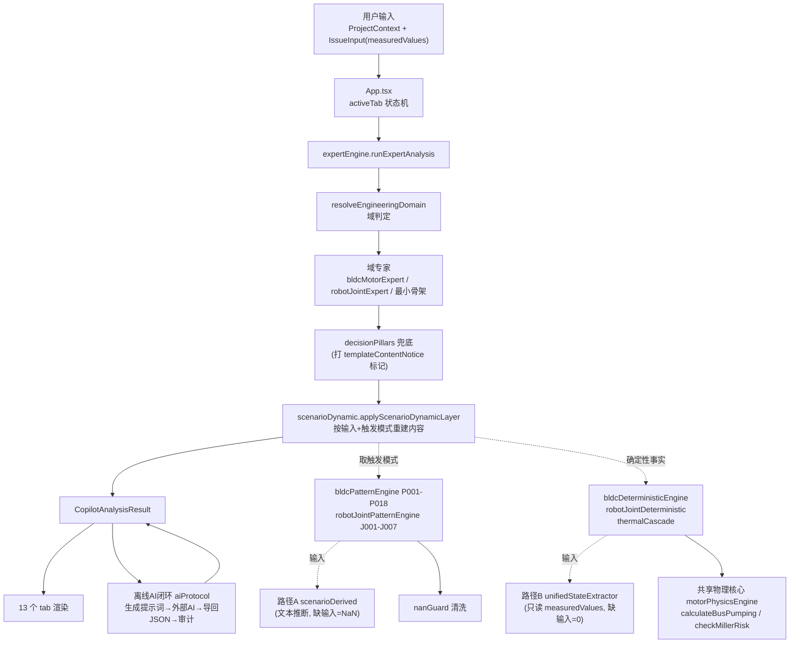

# backHW (ecu-hardware-copilot) 架构框图

> 本文基于当前代码实扫生成（文件规模、跨层依赖边、tab→组件映射、接口清单均为实测），用于快速理解本软件。

## 0. 一句话定位

**离线优先的车规硬件风险决策副驾**：把工程师的工况输入，经「共享物理核心 + 25 个车规判据模式」变成**可追溯**的风险结论、候选方案与受控文档；AI 只在离线闭环里做叙述增强，**数值必须锚定本地确定性计算结果**。

## 1. 两种运行形态

| 形态 | 命令 | 产物 |
|---|---|---|
| 开发/服务态 | `npm run dev` | `tsx server.ts` → Express(3000) + Vite 中间件，前端 SPA |
| 离线单文件 | `npm run build` | `dist/ecu-copilot-offline.html`（vite-plugin-singlefile，约 1.5MB，双击即用、零后端） |

## 2. 分层框图

```
┌───────────────────────────────────────────────────────────────────────┐
│ L5 视图层   src/components/*.tsx   13 tabs + 7 modals                 │
│  🌟第一屏 · 0工作流 · 1输入 · 2事实 · 3模式 · 4方案 · 5驾驶舱          │
│  6验证闭环 · 7功能安全 · 8评审回归 · 9RACI · 10受控文档 · 11计算器     │
└──────────────────────────────▲────────────────────────────────────────┘
                               │ props: context / issue / result
┌──────────────────────────────┴────────────────────────────────────────┐
│ L4 编排层   src/App.tsx (841行, activeTab 状态机)                      │
│             src/data/expertEngine.ts  runExpertAnalysis()              │
│   ①域判定 → ②域专家 → ③pillars兜底 → ④动态层 → ⑤多域基线/依据        │
└──────────────────────────────▲────────────────────────────────────────┘
                               │ CopilotAnalysisResult
┌──────────────────────────────┴────────────────────────────────────────┐
│ L3 内容生成层                                                          │
│   scenarioDynamic.applyScenarioDynamicLayer()   ← 输入驱动重建         │
│     candidateActions / raciMatrix / dfmeaItems / dualTimeline          │
│     containment / capa / 5大块 / engineeringDocs                       │
│   decisionPillars(6域模板·仅兜底)   dualTimelineEngine   aiResultAuditor│
└──────────────────────────────▲────────────────────────────────────────┘
                               │
┌──────────────────────────────┴────────────────────────────────────────┐
│ L2 判据层（确定性 · 去伪存真）                                         │
│   bldcPatternEngine      P001–P018 (18)  逆变桥电气物理                │
│   robotJointPatternEngine J001–J007 (7)  关节机电/安全/总线            │
│   nanGuard 清洗 NaN · verify-engines 断言覆盖全部 25 模式              │
└──────────────────────────────▲────────────────────────────────────────┘
                               │ BldcEvaluationInput / RobotJointEvaluationInput
┌──────────────────────────────┴────────────────────────────────────────┐
│ L1 物理计算 / 输入派生                                                 │
│   共享物理核心 motorPhysicsEngine                                      │
│     calculateBusPumping · checkMillerRisk · calculateSnubber…          │
│   确定性引擎 bldcDeterministic / robotJointDeterministic / thermalCascade│
│     （纪律：缺输入 → INSUFFICIENT_INPUT，禁止默认值顶替）              │
│   输入派生 路径A scenarioDerived  |  路径B unifiedStateExtractor       │
└──────────────────────────────▲────────────────────────────────────────┘
                               │ IssueInput / ProjectContext (measuredValues)
┌──────────────────────────────┴────────────────────────────────────────┐
│ L0 域注册表 / 静态数据                                                 │
│   scenarioDomainEngine 域判定·字段目录·物理画像·域指标·三色门禁        │
│   types.ts · types/v4Models.ts · deviceLibrary · presetScenarios       │
│   goldStandardCases(16验收) · designReviewEngine · safetyReliability   │
└───────────────────────────────────────────────────────────────────────┘
```

### Mermaid 版（支持渲染的环境可直接看）



## 3. 主数据流（一次分析的完整生命周期）

```
用户填工况 (tab1 ProjectContextView：自由文本 + 结构化 measuredValues)
        │
        ├─ setIssue/setContext → localStorage
        │    (scenarioStorage / analysisStorage)
        ▼
runExpertAnalysis(context, issue)                    [data/expertEngine.ts]
   │
   ├─① resolveEngineeringDomain(issue)               [utils/scenarioDomainEngine]
   │    依据 issueCategories + 自由文本关键词
   │    → BLDC / ROBOT_JOINT / EMC_BCI|ESD|RE_CE / WCCA(_EOL) /
   │      THERMAL / COMPONENT / POWER_TRANSIENT / GENERAL
   │
   ├─② 域专家产主结果
   │    BLDC        → generateBldcMotorAnalysis()     [data/bldcMotorExpert]
   │    ROBOT_JOINT → generateRobotJointAnalysis()    [data/robotJointExpert]
   │    其他        → buildMinimalOfflineResult()     （最小骨架，交给④填充）
   │
   ├─③ pillars 兜底（②缺字段时才用）
   │    getBldcPillars / getEmcPillars / getComponentPillars /
   │    getWccaPillars / getThermalPillars / getRobotJointPillars
   │    → 同时打 result.templateContentNotice 标记
   │      (UI 与"复制/导出受控文档"都会提示：通用模板内容，勿直接引用其中数字)
   │
   ├─④ applyScenarioDynamicLayer(result, ctx, issue)   [utils/scenarioDynamic]
   │    ◀── 关键：覆盖②③的模板内容，按「当前输入 + 当前触发的模式」重建
   │    · collectTriggeredPatterns()
   │        BLDC  → evaluateAllBldcPatterns(deriveBldcEvaluationInput(...))
   │        JOINT → evaluateAllRobotJointPatterns(deriveRobotJointEvaluationInput(...))
   │    · candidateActions = 触发模式的 candidateMeasures 组装三档
   │        (根治 conservative / 联合治理 balanced / 临时缓解 schedule_priority)
   │    · 方案 veto 跟随模式 vetoTriggered
   │    · raciMatrix / dfmeaItems / dualTimeline / containment / capa 按输入生成
   │
   ├─⑤ 补多域基线 multiDomainAnalysis + dualTimeline + analysisBasis + provenance
   ▼
CopilotAnalysisResult ──► 13 个 tab
```

## 4. 两条输入派生路径（A/B 并存，结果已对齐）

```
                  IssueInput (自由文本 + measuredValues)
                     │                            │
      路径A（喂模式引擎）                    路径B（喂确定性计算）
  deriveBldcEvaluationInput()          extractUnifiedEngineeringModel()
  deriveRobotJointEvaluationInput()                │
        │                                          │
  · 自由文本正则推断                          · 只读 measuredValues
  · 缺输入 → NaN（不伪造）                     · 缺输入 → 0/undefined
  · 输出扁平 BldcEvaluationInput              · 输出嵌套 UnifiedEngineeringModel
        │                                          │
  evaluateAllBldcPatterns()                calculateBldcDeterministicCalculations()
  evaluateAllRobotJointPatterns()          calculateRobotJointDeterministicCalculations()
        │                                  calculateThermalCascade()
        │                                          │
  P/J 模式的风险结论                       INSUFFICIENT_INPUT / CALCULATED 证据
```

**已审计**：13 个重叠字段上 A/B 完全一致；key 名已对齐（`harnessLengthM`、`ambientTempC`）。
V4 的选择是**让两条路径并存、各司其职**（A 管"给一段文本也要出风险判断"，B 管"没实测就不下结论"）。

## 5. 共享物理核心（唯一真源，防公式分叉）

```
                 motorPhysicsEngine.ts  (409 行)
   ┌────────────────────┬────────────────────┬─────────────────────┐
   │ calculateBusPumping│ checkMillerRisk    │ calculateSnubber…   │
   └─────────┬──────────┴─────────┬──────────┴──────────┬──────────┘
             │                    │                     │
   bldcDeterministicEngine   bldcPatternEngine      MotorDriveToolbox(UI)
    （主报告确定性计算）        P001 / P003 判据        （物理工具箱）
             │
   scenarioDomainEngine（域指标）
```

- `calculateBusPumping`：P001 与确定性引擎共用（含线束电感储能项 0.5·L·I²）
- `checkMillerRisk`：已提升为 P003 的先进模型 —— 阻性界 + **容性分压界（两界取小）** + **源极电感过冲** + **实测尖峰优先**；**向后兼容**（只传旧参数时行为不变）
- 回归锁：`verify-engines` 有断言强制 P001 必须走共享核心

## 6. 判据层：25 个模式

| 组 | 文件 | 数量 | 关注点 |
|---|---|---|---|
| P001–P018 | `data/bldcPatternEngine.ts` (1240行) | 18 | 母线泵升·反电势·米勒·死区(短/长)·热失控·EMI·霍尔·电流采样·UVLO·自举·母线电容·VDS裕量·保护独立性·SOA时序·采样架构·堵转 |
| J001–J007 | `data/robotJointPatternEngine.ts` (722行) | 7 | 背隙+柔性·编码器电池·二质量谐振·泄放电阻热·力矩闭环·STO通道独立·总线耦合 |

语义区分（重要）：
- **P**：`patternKind: 'DETECTED_RISK' | 'CHECKLIST'`（P015/P017 是设计评审清单，允许恒 true）
- **J**：`triggered`（该分析是否适用）+ `vetoTriggered`（真告警 / 一票否决）

## 7. 离线 AI 闭环（4 步）

```
┌── 前端 AiOfflineModal ────────────────────────────────────────────┐
│ ① 生成提示词 buildAnalysisPrompt()            [utils/aiProtocol]   │
│    = 系统提示(20年车规首席架构师) + 工况 + 本地确定性事实层        │
│      + 输入完整度审计 + 金标准参考 + JSON 字段清单                 │
│    红线：本地预核算数值必须直接引用；缺失参数一律 UNKNOWN          │
│ ② 复制 → 粘贴到任意免费 AI（DeepSeek/GPT/…）→ 拿回纯 JSON          │
│ ③ 导回 healAndParseJson → validateAiResultStructure(zod)           │
│      → validateAndEnrichAiResult → auditAiResult(反幻觉审计)       │
│ ④ 落库渲染，provenance 标注 ONLINE_AI_INFERRED                     │
└───────────────────────────────────────────────────────────────────┘
```
在线态走 `server.ts /api/copilot/analyze`（Gemini / OpenAI 兼容），**同一套协议**在 `utils/aiProtocol` 共享。

## 8. 服务端接口（`server.ts` 1426 行）

| 接口 | 作用 |
|---|---|
| GET `/api/health` | 健康检查 |
| GET `/api/download/offline-html` | 下载离线单文件 HTML |
| GET `/api/download/source-zip` · `source-tar` | 下载全量源码包 |
| POST `/api/copilot/analyze` | 在线大模型分析（含重试与本地降级） |
| POST `/api/copilot/assess-input` | 输入完整度审计 |
| POST `/api/copilot/build-prompt` | 只生成提示词（离线闭环第①步） |
| POST `/api/copilot/import-ai-result` | 导入 AI 返回 JSON（第③步） |
| POST `/api/copilot/calculate` | 确定性物理计算 |
| POST `/api/copilot/generate-doc` | 生成受控文档 |
| POST `/api/copilot/test-model` | 模型连通性测试 |

## 9. 视图层清单（13 tabs + 7 modals）

| tab | 组件 | 行数 | 主要读取 |
|---|---|---|---|
| 0 workflow | EngineeringWorkflowView | 328 | issue / result |
| 🌟 overview | FirstScreen10sView | 324 | next24HourPlan · 物理机理 · 门禁 |
| 1 input | ProjectContextView | 1218 | 域字段目录 → measuredValues |
| 2 facts | AnalysisFactView | 566 | classifiedInfo · dfmeaItems · redTeam · bldcExtended |
| 3 patterns | BldcPatternEngineView | 551 | evaluateAllBldcPatterns / RobotJoint |
| 4 options | OptionsComparisonView | 288 | candidateActions |
| 5 cockpit | DecisionCockpitView | 1249 | multiRiskBreakdown · whyNot · 双时间轴 · 领导博弈 |
| 6 verification | VerificationLoopView | 438 | verificationLoopEngine |
| 7 safety | FunctionalSafetyReliabilityView | 691 | HARA/FMEDA/FTA · 电容寿命 · 二供PCN · ESD/BCI |
| 8 review | DesignReviewRegressionView | 461 | designReviewEngine · goldStandardCases |
| 9 recommendation | RecommendationRaciView | 1759 | raciMatrix · dualTimeline · 多方博弈 |
| 10 docs | EngineeringDocsView | 1000 | engineeringDocs（EDR/让步单/PPAP/邮件） |
| 11 calc | EngineeringCalculatorView + MotorDriveToolbox | 1271 + 1253 | mathPhysicsEngine · motorPhysicsEngine |

modals：ModelSettings · ScenarioManage · SourceDownload · DeviceLibrary · AiOffline · OscilloscopeImport · CreateScenario

## 10. 关键类型（读代码的入口）

| 类型 | 文件 | 作用 |
|---|---|---|
| `ProjectContext` / `IssueInput` | `types.ts` | 输入契约 |
| `CopilotAnalysisResult` | `types.ts` | 结果契约（13 个 tab 都消费它） |
| `BldcEvaluationInput` | `data/bldcPatternEngine.ts` | 路径 A 的扁平入参 |
| `UnifiedEngineeringModel` | `types/v4Models.ts` | 路径 B 的嵌套状态树 |
| `BusPumpingResult` / `MillerRiskResult` | `types/motorDrive.ts` | 共享物理核心返回 |
| `ClassifiedInfoItem` · `DFMEAView` · `RaciItem` · `DualTimelineActionPlan` | `types.ts` | 内容块 |

## 11. 质量门禁

```
.github/workflows/ci.yml
  npm ci → tsc --noEmit(strict) → npm test → npm run build

scripts/verify-engines.ts (342行, tsx 直跑, 无测试框架)
  · 确定性引擎缺输入 → 必须 INSUFFICIENT_INPUT（不许默认值顶替）
  · 25 模式负例（温和工况不得触发）+ 重点正例 + CHECKLIST 语义
  · 16 个金标准验收 case（真实调模式引擎，不是照抄期望值）
  · P001 必须走共享物理核心（防公式再次分叉）
  · J 模式健康工况零否决 + 关键失效闭锁（含 PL 未声明 fail-closed）
```

## 12. 被依赖最多的模块（改动的爆炸半径）

| 入度 | 模块 | 含义 |
|---|---|---|
| 47 | `types.ts` | 所有契约的根，改它影响全局 |
| 15 | `scenarioDomainEngine` | 域注册表：域判定/字段/画像/指标，几乎每个视图都读 |
| 5 | `scenarioDerived` | 路径 A + 安全/评审/验证派生 |
| 5 | `unifiedStateExtractor` | 路径 B 结构化事实 |
| 5 | `types/v4Models.ts` | 嵌套模型与模式类型 |
| 4 | `TemplateContentNotice` | 模板内容提示组件 |
| 3 | `motorPhysicsEngine` | 共享物理核心（被 P001/P003 与确定性引擎共用） |
