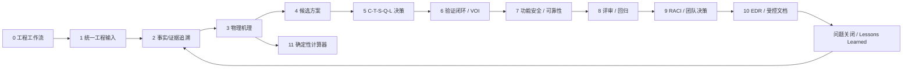
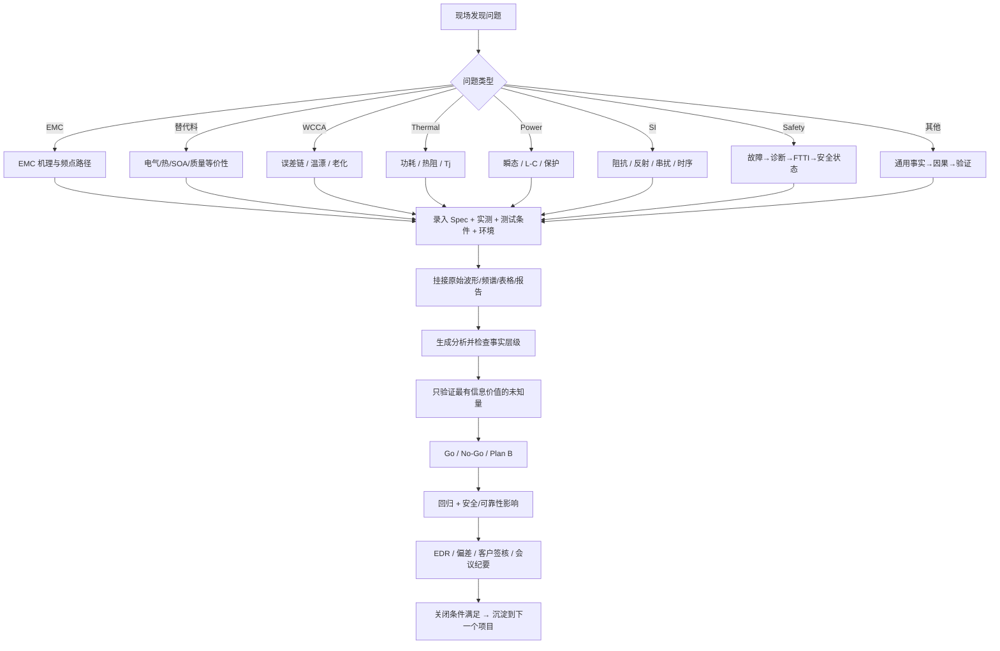

# ECU Copilot 工程使用说明

## 1. 软件定位

ECU Copilot 不应被当作“自动写报告”的工具，而应被当作一套工程问题闭环工作台：

> **把现场问题转换成结构化事实 → 找到主导物理机理 → 形成候选措施 → 用最小验证集消除关键不确定性 → 做 C-T-S-Q-L 决策 → 形成回归与受控文档。**

核心原则：

- MEASURED（实测）优先于 CALCULATED（计算），CALCULATED 优先于 ASSUMPTION（假设）。
- “模型建议”不能直接代替实验、客户批准、标准判定或安全签核。
- 一个工程问题必须有明确的关闭条件、责任人、证据和回归记录。

## 2. 软件模块关系

## 3. 实际工作使用流程

## 4. 真实数据怎么进入系统

推荐使用顺序：

1. 先填写 Requirement、Actual Measurement、Test Condition、Environment、Failure Phenomenon。
2. 再填写结构化实测值，例如 rpm、母线峰值、结温、EMC 峰值、精度误差等；不适用的留空。
3. 上传原始 CSV、频谱、示波器导出、温箱报告、WCCA 表格、供应商 Datasheet/PPAP/PCN 等。
4. 点击重新分析。
5. 在“事实证据”页确认每一个关键数字究竟属于 MEASURED、SPEC、CALCULATED 还是 ASSUMPTION。
6. 只有当 CALCULATED/ASSUMPTION 被实测或正式文件证实后，才应该进入最终 EDR。

## 5. 每类典型问题最小数据集

| 问题类型 | 最少需要的数据 |
|---|---|
| EMC | 超标频点、幅度、限值、线束、屏蔽/接地状态、开关频率 |
| 替代料 | Rds(on)、Qg/Qgd、tr/tf、SOA、热阻、AEC/PPAP/PCN |
| WCCA | 各误差项、公差、温漂、老化、Mission Profile、样本分布 |
| Thermal | Ta、I、V、频率、损耗、Rth、结构/铜厚/气流 |
| Power | 负载阶跃、di/dt、L/C/ESR/ESL、过冲/跌落、保护阈值 |
| SI | 速率、上升沿、Z0/ZL、线长、终端、眼图/TDR |
| Safety | Safety Goal、ASIL、FTTI、诊断覆盖率、反应时间 |
| Customer/Deviation | 客户原始需求、当前假设、节点、书面回复状态、变更边界 |

## 6. 一个典型实际例子

例如现场收到一张截图：

> “150MHz RE 超标 +3dB，2周后 DV。”

不要直接把“加磁珠”作为结论。推荐按下面步骤：

- 1. 记录原始频谱、测试配置、线束、屏蔽/接地状态；
- 2. 判断峰值来自板级源还是线束共模耦合；
- 3. 在第 3 页看 EMC 物理链和最小验证集；
- 4. 在第 4/5 页比较“改板 / CMC / 屏蔽 / 布局 / 临时措施”的时间、成本、质量风险；
- 5. 第 6 页只做最能区分根因的 A/B 试验；
- 6. 第 8 页把正式 DV 回归频点和变更影响固定下来；
- 7. 第 10 页生成受控记录，并保留原始频谱作为证据附件。

这样软件才是在“参与工程”，而不是“替工程师写结论”。
