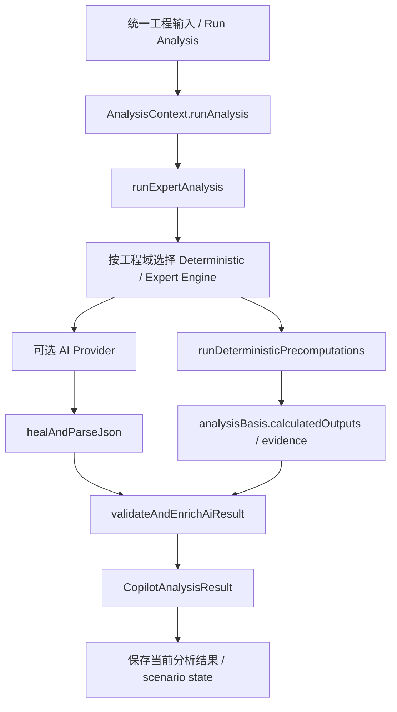
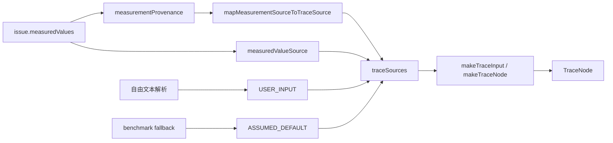

# ECU Copilot 实际分析 Pipeline 与 Phase 5 Trace 链

> 本文只描述当前源码中已经存在或本 Phase 5 已接入的真实调用关系，不把计划中的架构当成已实现事实。

## 1. 主分析链（Analysis）



`runAnalysis` 的核心职责是编排：准备输入 → 调用专家分析 → 补充确定性计算证据 → 对 AI 结构化结果做清洗/增强 → 将最终结果保存到当前场景状态。Phase 5 不替换这条主链。

## 2. BLDC Pattern 链（Pattern 页面）

BLDC Pattern 页面不是重新调用 AI。它从当前 `ProjectContext + IssueInput` 重新派生确定性输入，然后直接运行 `evaluateAllBldcPatterns`：

```mermaid
flowchart LR
  I[IssueInput / measuredValues / measurementProvenance] --> D[deriveBldcEvaluationInput]
  D --> S[traceSources + traceEvidenceIds]
  D --> P[BldcEvaluationInput]
  P --> E[evaluateAllBldcPatterns]
  E --> O[PatternOutputItem]
  O --> T[trace?: TraceNode[]]
  T --> UI[Pattern Trace Drawer / Trace Audit]
```

Phase 5 当前覆盖 `P001 ~ P018` 全部 Pattern。数值型 Pattern 使用确定性计算 Trace，P009/P010/P018 使用逻辑证据链，P015/P017 使用 Checklist 参考链，不伪造不存在的数值公式。

## 3. Trace 的字段级来源链



优先级是：结构化字段的逐字段 provenance > 工程级 measuredValueSource > 自由文本解析/用户输入 > benchmark 假设。导入示波器时，`evidenceId` 可以从 `TraceInput` 回链到本地 `waveformStorage`。

## 4. Trace 判定链

```mermaid
flowchart TD
  IN[TraceInput[]] --> FORMULA[确定性公式]
  FORMULA --> VALUE[计算 Value]
  VALUE --> TH[Threshold]
  TH --> VERDICT[PASS / MARGINAL / FAIL / CRITICAL]
  IN --> DEG[若输入含 ASSUMED_DEFAULT / SPEC_CONSTANT → degraded]
  VALUE --> NODE[TraceNode]
  VERDICT --> NODE
  DEG --> NODE
```

`degraded` 不是风险等级，它描述的是**证据输入等级**。因此“PASS + degraded=true”是允许的：含假设值时，公式可以得到数量级结论，但还需要工程师补实测/器件规格后重新确认。

## 5. UI 入口

- `3. 物理机理 / 场景引擎`：Pattern 行内或详情页可打开 Trace Drawer。
- `12. Trace 审计`：查看当前 BLDC case 的 Trace 汇总，可筛选“只看待实测/规格确认”和“只看 FAIL / CRITICAL”。
- Trace Drawer 内可切换“逐项 Trace / 因果流程图”。

## 6. 不做的事

Phase 5 不把 AI 文案重新解析成 Trace，也不把 `calculatedValues` 的显示文本反推公式；Trace 必须由确定性 Pattern Engine 同时产出，避免 UI 与物理计算脱节。
